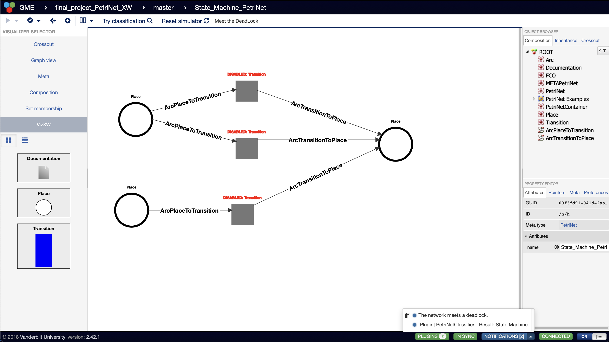
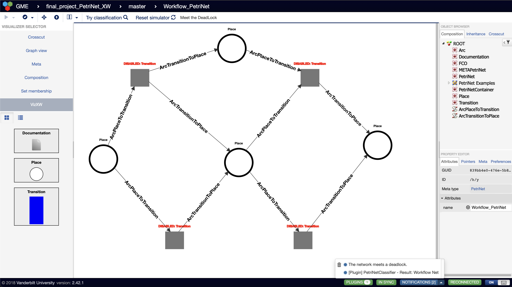

# WDeStuP_XW
This repository is intended to finish the mini project for CS 6388-01 Model-Integrated Comp (2022F) of Vanderbilt University. Firstly, I forked the project in git from: https://github.com/kecso/WDeStuP.

## Initialization
The steps to srart-up the studio are as below:
- install [Docker-Desktop](https://www.docker.com/products/docker-desktop).
- clone the repository.
- edit the '.env' file so that the BASE_DIR variable points to the main repository directory.
- use docker commands to build the mongobd container and webgme container:
    - **build** container: `docker-compose build`.
    - **start** container: `docker-compose up -d`.
    - **stop** container: `docker-compose stop`.
    - **enter** container: `docker-compose exec webgme bash`.
    - **clean** container: `docker system prune -f`.
- connect to server at http://localhost:8888.

## Adding the MetaPetriNet seed
The steps of add seed:
- create the MetaPetriNet seed on https://mic.isis.vanderbilt.edu/. The project seed includes the fundamental features of the PetriNet model. Use the Meta Visualizer to cerate the Meta model of PetriNet, and the meta views show as below.
- export the PetriNet meta model via `master > Export branch`. Then create the folder `seeds` within the `src` folder and placed the exported webgmex file in that folder with the name of `seedPetriNet_XW.webgmex`.
- add config in webgme-setup.json under `"components"`:
```
"seeds": {
      "PetriNetProjectSeed": "src/seeds/seedPetriNet_XW"
    }
```
- add config in config.webgme.js:
```
config.seedProjects.basePaths.push("src/seeds");
```
- copy webgme-setup.json: `docker-compose cp webgme:/usr/app/webgme-setup.json webgme-setup.json`.
- copy webgme-config: `docker-compose cp webgme:/usr/app/config/config.webgme.js config/config.webgme.js`.

### METAView


### PetriNetView


### ROOTCompositionView


## Adding new visualizer
Follow these steps to add a new visualizer:
- enter the container.
- creare new JS visualizer: `npm run webgme new viz VizXW`. `VizXW` is the new visualizer's name.
Then config code will add in webgme-setup.json under `"components"` automatically:
```
"visualizers": {
      "VizXW": {
        "src": "panels/VizXW/VizXWPanel",
        "title": "VizXW",
        "panel": "src/visualizers/panels/VizXW",
        "secondary": false,
        "widget": "src/visualizers/widgets/VizXW"
      }
    }
```
Also, config code will add in config.webgme.js automatically:
```
var config = require('webgme/config/config.default'),
    validateConfig = require('webgme/config/validator');

config.visualization.panelPaths.push(__dirname + "/../src/visualizers/panels");

config.visualization.visualizerDescriptors.push(
  __dirname + "/../src/visualizers/Visualizers.json"
);

config.requirejsPaths = {
  panels: "./src/visualizers/panels",
  widgets: "./src/visualizers/widgets",
};
```
Finally, folder `visuallizers` will be added under `./src` automatically, which contains `./panels/VizXW/VizXWControl.js`, `./panels/VizXW/VizXWPanel.js`, `./widgets/VizXW/VizXWWidget.js`, `./widgets/VizXW/styles/VizXWWidget.css`, `./widgets/VizXW/styles/VizXWWidget.scss`, `./Visualizers.json`. Plus, These files contain general functions and config. To create customized functions, most adding codes are in `./panels/VizXW/VizXWControl.js` and `./widgets/VizXW/VizXWWidget.js`.
- exit container.
- copy webgme-setup.json: `docker-compose cp webgme:/usr/app/webgme-setup.json webgme-setup.json`.
- copy webgme-config: `docker-compose cp webgme:/usr/app/config/config.webgme.js config/config.webgme.js`.

## Adding new plugin
Follow these steps to add a new plugin:
- enter the container.
- create new JS plugin: `npm run webgme new plugin PetriNetClassifier`. `PetriNetClassifier` is the new plugin's name.
Then config code will add in webgme-setup.json under `"components"` automatically:
```
"plugins": {
      "PetriNetClassifier": {
        "src": "src/plugins/PetriNetClassifier",
        "test": "test/plugins/PetriNetClassifier"
      }
```
Also, config code will add in config.webgme.js automatically:
```
config.plugin.basePaths.push(__dirname + "/../src/plugins");
```
Finally, folder `plugins` will be added under `./src` automatically, which contains `./plugins/PetriNetClassifier/PetriNetClassifier.js`, `./plugins/PetriNetClassifier/metadata.json`. Plus, These files contain general functions and config. To create customized functions, most adding codes are in `./plugins/PetriNetClassifier/PetriNetClassifier.js`.
- exit container.
- copy webgme-setup.json: `docker-compose cp webgme:/usr/app/webgme-setup.json webgme-setup.json`.
- copy webgme-config: `docker-compose cp webgme:/usr/app/config/config.webgme.js config/config.webgme.js`.

## Decoration
Use the SVG decoration. Places are circles and Transitions are blue bars.

# PetriNet Use Case
The PetriNet mini project assignment description is in the document [Miniproject.pdf]. Petri nets are specific types of modeling constructs useful in data analysis, simulations, business process modeling and other scenarios. This type of mathematical construct can help to plan workflows or present data on complicated systems.
In this project, the main task is to implement the visualizer which could conduct the PetriNet classification plugin and the specific simulator.
- For PetriNet classification plugin (PetriNetClassifier), embedded in the VizXW visualization environment, it needs to show the PetriNet type for the specific PetriNet instance. There are 4 PetriNet types:
    1. Free Choice PetriNet: if the intersection of the inplaces sets of two transitions are not empty, then the two transitions should be the same (or in short, each transition has its own unique set if inplaces).
    2. State Machine PetriNet: a PetriNet is a state machine if every transition has exactly one inplace and one outplace.
    3. Marked Graph PetriNet: a PetriNet is a marked graph if every place has exactly one out transition and one in transition.
    4. Workflow PetriNet: a PetriNet is a workflow net if it has exactly one source place s where s^* = ∅, one sink place o where o^* = ∅, and every x ∈ P ∪ T is on a path from s to o.
- For the simulator, it should:
    1. visualize the network similarly to the composition.
    2. differentiate the transitions that are enabled.
    3. Firing should happen once the user clicks on an enabled transition.
    4. Markings should progress according to firings.
    5. The visualizer should have a ‘reset’ button on its toolbar that switches the network back to the initial marking.
    6. The state of the simulation should not be reflected in the model.
    7. If the network reaches a deadlock (there is no enabled transition), some visual effect should notify the user.

## PetriNet classification
### State Machine PetriNet


### Workflow PetriNet


## Simulator
### Fire Single Transition [satisfied simulator requirement of No.i~vi]
https://user-images.githubusercontent.com/112347330/206939284-480bea55-0b42-48c3-9d42-260583434c79.mov

### Deadlock PetriNet [satisfied simulator requirement of No.vii]


# Reference

- Environment Initialization: https://github.com/kecso/WDeStuP.
- Develop Streamline and PetriNet Meta Model: https://github.com/austinjhunt/petrinet-webgme-designstudio.
- Visualizer and Plugin Functions: https://github.com/BeneneeYu/petri-net-design-studio.